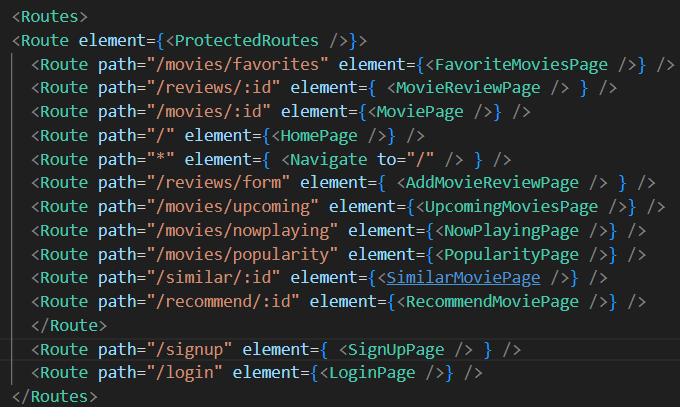
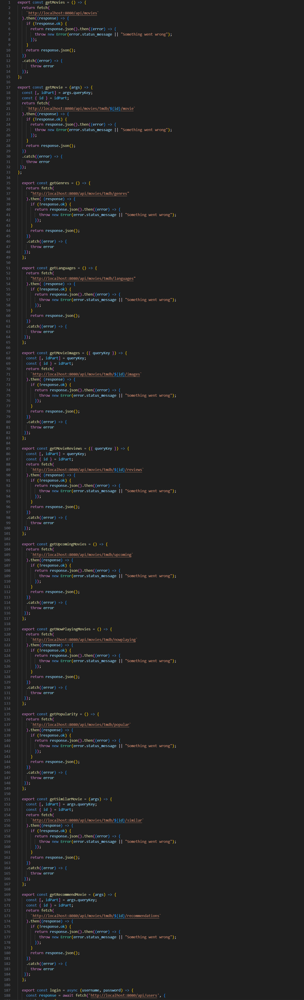
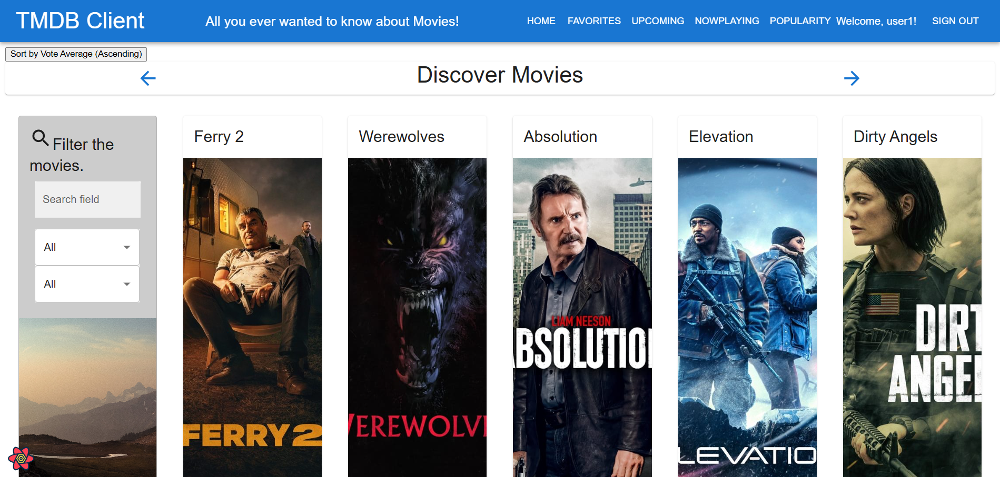
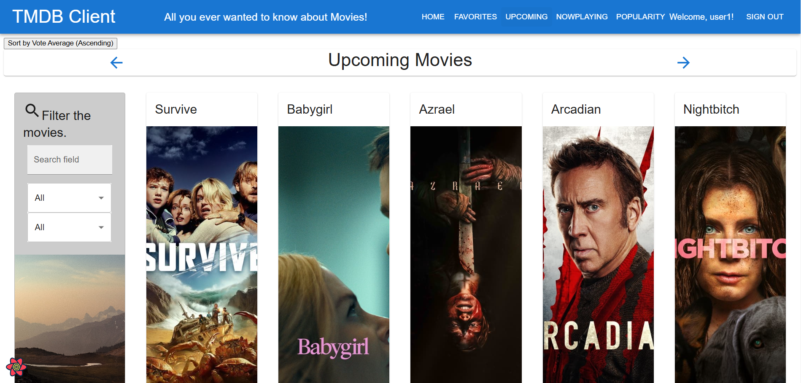
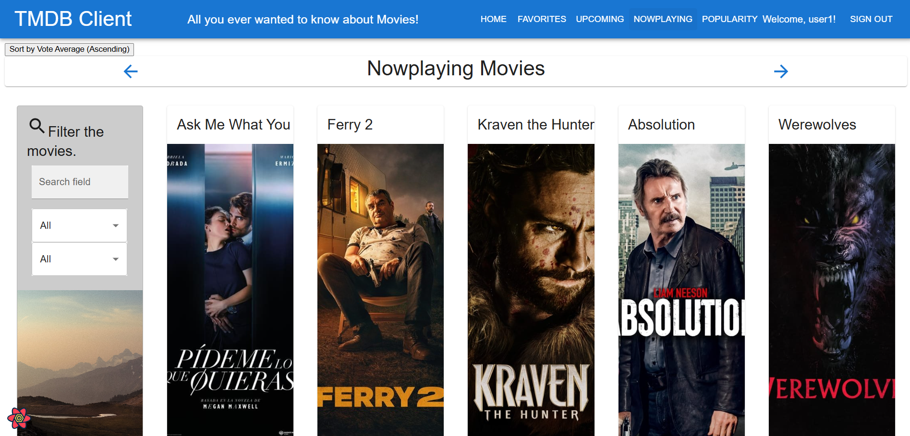
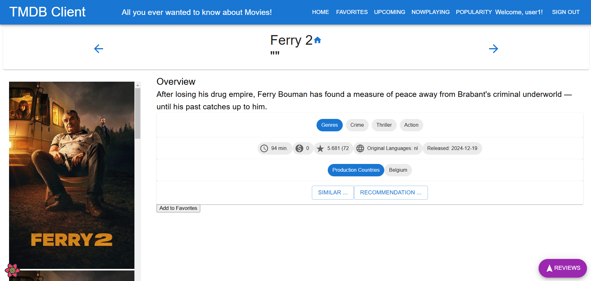
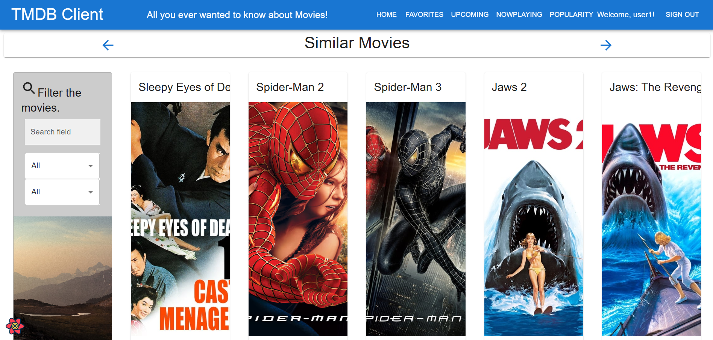
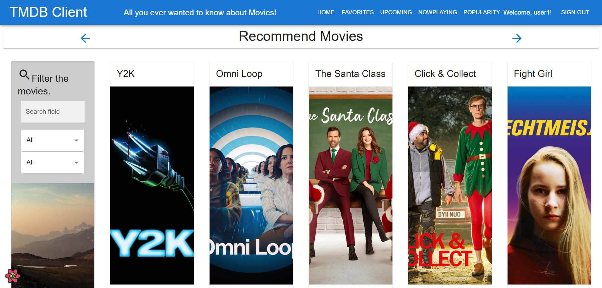

# Assignment 2 - Web API.

Name: Huyi Cui

## Features.

 + Login Functionality
 + Registration Function
 + Protect data and make it inaccessible before logging in 
 + Use custom API to replace TMDB API

## Setup requirements.

After opening the file in VS Code, open a console and enter the npm install command. After downloading, enter the npm run dev command in the movies-api folder to start the api, and enter the npm start command in the react-movies file to start the front-end page. Please make sure to start the api before starting the front-end page, otherwise no data will be obtained on the page.

## API Configuration

Enter the following content in the .env file:

NODE_ENV=production
PORT=8080
HOST=localhost
MONGO_DB=Your_Mongo_URL
TMDB_KEY=Your_TMDB_KEY
SECRET=Your_Secret_Key

NODE_ENV=production: Specifies that the current environment of the application is production.
PORT=8080: Indicates the port number that the application listens on. When the application starts, it will accept network requests on this port.
HOST=localhost: Indicates the host name or IP address where the application is running.
MONGO_DB=Your_Mongo_URL: Indicates the connection string of the MongoDB database. After reading this variable in the application, the corresponding connection URL will be used to access MongoDB. If you want to deploy in different environments, you need to set different MongoDB URLs to prevent mutual interference.
TMDB_KEY=Your_TMDB_KEY: Indicates the key for obtaining API data from TMDB (The Movie Database).
SECRET=Your_Secret_Key: A common usage is to use this value as the encryption or signing key for the application

## API Design

- /api/movies | GET | Gets a list of movies 
- /api/movies/{movieid} | GET | Gets a single movie 
- /api/movies/tmdb/genres | GET | Get the movies' genres 
- /api/movies/tmdb/languages | GET | Get the movies' languages 
- /api/movies/tmdb/upcoming | GET | Gets a list of upcoming movies 
- /api/movies/tmdb/nowplaying | GET | Gets a list of nowplaying movies 
- /api/movies/tmdb/popular | GET | Gets a list of now popular movies 
- /api/movies/tmdb/{movieid}/similar | GET | Get similar movies to a specific movie 
- /api/movies/tmdb/{movieid}/recommendations | GET | Get similar movies to a specific movie 
- /api/movies/tmdb/{movieid}/movie | GET | Get recommendated movies to a specific movie 
- /api/movies/tmdb/{movieid}/images | GET | Get images to a specific movie 
- /api/movies/tmdb/{movieid}/reviews | GET | Get reviews to a specific movie 

- /api/users | GET | Gets a list of users 
- /api/users | POST | Register(Create)/Authenticate User
- /api/users/{userid} | PUT | Update a user
- /api/users/{userid}/favourites | POST | Gets a list of a sepcific user's favourite movies
- /api/users/{userid}/favourites | GET | Add a movie to a sepcific user's favourite movies list

## Security and Authentication
Login registration through the users API and protect the page so that it cannot be viewed when not logged in

## Integrating with React App

First, I created several new APIs in the api, including /api/movies/tmdb/languages, /api/movies/tmdb/upcoming, /api/movies/tmdb/nowplaying, /api/movies/tmdb/popular, /api/movies/tmdb/{movieid}/similar, /api/movies/tmdb/{movieid}/recommendations, /api/movies/tmdb/{movieid}/movie, /api/movies/tmdb/{movieid}/images, and /api/movies/tmdb/{movieid}/reviews, to replace the original TMDB API to display information.

